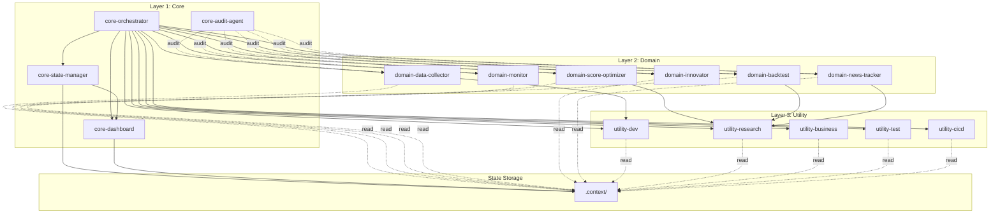

# Agent Registry

에이전트 등록소 - 모든 에이전트의 메타데이터 및 관계 정의

## Layer 0: Arena (8팀 경쟁 시스템)

활성 팀: team_a (Alpha Momentum), team_c (Gamma Disclosure), team_d (Delta Theme), team_e (Echo Frontier), team_f (Zeta Volatility), team_g (Kappa Turtle), team_h (Theta Sector), team_i (Alpha-Delta Hybrid).
비활성: **team_b (Beta Contrarian)** — 2026-04-19 비활성화 (상승장 구조적 역풍, 누적 -15.93%). `leaderboard.json`의 `archived_teams` 참조. 복귀 조건은 `.claude/context/decisions.md` 참조.

| Agent | Skill Command | Role | Dependencies |
|-------|---------------|------|--------------|
| **arena-orchestrator** | `/arena` | 8팀 경쟁 총괄 - git pull → 팀 분석 → 심판 평가 → 결과 반영 | arena-team-analyzer, arena-judge |
| **arena-team-analyzer** | `/arena-team-analyze {team_id}` | 팀별 성과 분석, 패턴 발견, 파라미터 개선 제안, journal 업데이트 | data/arena/{team_id}/ |
| **arena-judge** | `/arena-judge` | 8팀 비교 평가, 등급 부여, 전략 간 상관관계, 종합 인사이트 | data/arena/ 전체 |
| **arena-ops-checker** | `/arena-ops-check {date}` | 일일 운영 점검 - Actions/종목선정/매매/정산/텔레그램/대시보드 | gh CLI, data/ 전체 |

### Arena 실행 흐름
```
/arena (사용자 호출)
    ↓
git pull → 상태 파악
    ↓
/arena-team-analyze team_a ─┐
/arena-team-analyze team_c ─┤
/arena-team-analyze team_d ─┤
/arena-team-analyze team_e ─┤ 8팀 병렬 분석
/arena-team-analyze team_f ─┤ (team_b 제외, archived)
/arena-team-analyze team_g ─┤
/arena-team-analyze team_h ─┤
/arena-team-analyze team_i ─┘
    ↓
/arena-judge (심판 평가)
    ↓
결과 반영 → git commit → 사용자 보고
```

## Layer 1: Core (핵심)

| Agent | Skill Command | Role | Dependencies |
|-------|---------------|------|--------------|
| **orchestrator** | `/core-orchestrator` | 작업 분석, 에이전트 조율, 결과 통합 | 모든 L2/L3 에이전트 |
| **audit-agent** | `/core-audit-agent` | 품질 검증, 성과 감시, 오류 탐지 | 모든 에이전트 |
| **state-manager** | `/core-state-manager-agent` | 에이전트 간 컨텍스트 기록/공유/정리 | .context/ 디렉토리 |
| **dashboard-agent** | `/core-dashboard-agent` | 하네스 구조/상태 시각화, HTML 대시보드 자동 갱신 | .claude/harness/, .context/ |
| **ux-reviewer** | `/core-ux-reviewer` | UX/사용성 전문 검토, 사용자 관점 비평 | quality_gate.md |
| **security-checker** | `/core-security-checker` | 보안 취약점 탐지, 배포 전 보안 감사 | quality_gate.md |

## Layer 2: Domain (도메인 특화)

| Agent | Skill Command | Role | Input | Output |
|-------|---------------|------|-------|--------|
| **data-collector** | `/domain-data-collector-agent` | DART/네이버/pykrx 데이터 수집 | 종목코드, 날짜범위 | 수집된 데이터 |
| **score-optimizer** | `/domain-score-optimizer-agent` | 135점 시스템 가중치 분석 | 스코어 데이터 | 최적화 권고 |
| **backtest** | `/domain-backtest-agent` | 성과 분석, 패턴 발견 | 거래 데이터 | 분석 리포트 |
| **monitor** | `/domain-monitor-agent` | 실시간 가격 추적, 알림 | 모니터링 조건 | 알림/상태 |
| **innovator** | `/domain-innovator-agent` | 신규 규칙, 창의적 아이디어 | 문제 정의 | 혁신 제안 |
| **news-tracker** | `/domain-news-tracker-agent` | 실시간 뉴스, 이슈, 트렌드 | 검색 키워드 | 뉴스 요약 |

## Layer 3: Utility (유틸리티)

| Agent | Skill Command | Role | Tools |
|-------|---------------|------|-------|
| **dev-agent** | `/utility-dev-agent` | 코드 작성, 리뷰, 테스트 | Read, Edit, Write, Bash, Grep |
| **research-agent** | `/utility-research-agent` | 웹 검색, 정보 수집 | WebSearch, WebFetch, Read |
| **business-agent** | `/utility-business-agent` | 보고서, 문서, 이메일 | Write, Read |
| **test-agent** | `/utility-test-agent` | 테스트 작성, 실행, 커버리지 | Bash, Read, Write, Edit, Grep |
| **cicd-agent** | `/utility-cicd-agent` | CI/CD 관리, 워크플로우, 배포 | Bash(gh), Read, Write, Edit |

## Quick Reference

```
# Arena (L0) - 8팀 경쟁 시스템 (team_b는 2026-04-19 archived)
/arena                         # 전체 오케스트레이션 (git pull → 분석 → 평가 → 반영)
/arena-team-analyze team_a     # Team A 분석 (Alpha Momentum)
/arena-team-analyze team_c     # Team C 분석 (Gamma Disclosure)
/arena-team-analyze team_d     # Team D 분석 (Delta Theme)
/arena-team-analyze team_e     # Team E 분석 (Echo Frontier)
/arena-team-analyze team_f     # Team F 분석 (Zeta Volatility)
/arena-team-analyze team_g     # Team G 분석 (Kappa Turtle)
/arena-team-analyze team_h     # Team H 분석 (Theta Sector)
/arena-team-analyze team_i     # Team I 분석 (Alpha-Delta Hybrid)
/arena-judge                   # 심판 평가 (8팀 비교)
/arena-ops-check               # 운영 점검 (Actions/선정/매매/정산/텔레그램/대시보드)
/arena-ops-check 20260409      # 특정 날짜 점검

# Core (L1)
/core-orchestrator             # 작업 조율
/core-audit-agent              # 품질 감사
/core-state-manager-agent      # 상태 관리
/core-dashboard-agent          # 대시보드 갱신
/core-ux-reviewer              # UX 전문 검토
/core-security-checker         # 보안 감사

# Domain (L2)
/domain-data-collector-agent    # 데이터 수집
/domain-score-optimizer-agent   # 점수 최적화
/domain-backtest-agent          # 백테스트
/domain-monitor-agent           # 모니터링
/domain-innovator-agent         # 혁신 제안
/domain-news-tracker-agent      # 뉴스 추적

# Utility (L3)
/utility-dev-agent        # 개발
/utility-research-agent   # 리서치
/utility-business-agent   # 비즈니스
/utility-test-agent       # 테스트
/utility-cicd-agent       # CI/CD
```

## Execution Model

슬래시 커맨드와 Agent 도구의 역할 분리:

- **슬래시 커맨드**: 에이전트 **정의**(역할 프롬프트). 예: `/core-orchestrator`는 오케스트레이터의 역할과 지침을 정의
- **실제 실행**: Agent 도구를 사용하여 컨텍스트 분리된 환경에서 실행

### 실행 패턴

| 패턴 | 방법 | 사용 시점 |
|------|------|----------|
| **병렬 실행** | 하나의 메시지에서 여러 Agent() 호출 | 독립적 작업 (예: 데이터 수집 + 뉴스 추적) |
| **순차 실행** | Agent() 호출을 순서대로 진행 | 의존적 작업 (예: 수집 → 분석 → 백테스트) |

### 상태 공유

에이전트 간 상태 공유는 `.context/` 파일을 통해 이루어지며, **state-manager**가 관리:

1. 에이전트 실행 결과를 `.context/`에 기록
2. 다음 에이전트가 `.context/`에서 컨텍스트를 읽어 사용
3. 작업 완료 후 state-manager가 불필요한 컨텍스트 정리

## Agent Relationships



## Orchestrated Flow

```
User Request
    ↓
orchestrator (분석 및 작업 분해)
    ↓
Agent() 스폰 (병렬/순차)
    ↓
state-manager 기록 (.context/ 갱신)
    ↓
결과 통합
    ↓
/core-audit-agent (검증) [선택적]
    ↓
최종 결과 → User
```

## State Management

에이전트 간 컨텍스트 공유 (state-manager 관리):
- **state.json**: 현재 작업 상태
- **decisions.md**: 의사결정 로그
- **findings.md**: 수집된 정보

## Quality & Issue Management

### 품질 검증 프로세스

```
에이전트 작업 완료 → 체크리스트 검증 → PASS/FAIL 판정
                                          ↓
                              FAIL 시 재전달 (최대 3회)
                                          ↓
                              3회 실패 시 사용자 보고
```

### 이슈 트래킹

- **이슈 파일**: `.claude/context/issues.md`
- **체크리스트**: `.claude/harness/protocols/quality-checklist.md`
- **작업 전**: 관련 이슈 검색하여 재발 방지
- **문제 발생 시**: 새 이슈 등록

### 재전달 정책

| 시도 | 조치 |
|------|------|
| 1차 실패 | 실패 항목 + 수정 제안 → 재전달 |
| 2차 실패 | 다른 접근 방식 + 이슈 참조 → 재전달 |
| 3차 실패 | 사용자 보고 + 이슈 등록 |

## Update Log

| Date | Change | Author |
|------|--------|--------|
| 2026-04-09 | Arena L0 레이어 추가 (arena, arena-team-analyze, arena-judge) | System |
| 2026-04-03 | 자동 라우팅, 이슈 트래킹, 품질 검증 재전달 시스템 추가 | System |
| 2026-04-02 | dashboard-agent 추가, 하네스 대시보드 시스템 도입 | System |
| 2026-04-02 | test-agent, cicd-agent 추가, 프로젝트 라우터 및 에러 복구 전략 추가 | System |
| 2026-04-01 | state-manager 추가, Execution Model 정의, 아키텍처 다이어그램 갱신 | System |
| 2026-03-31 | Prefix 방식으로 전환 | System |
| 2026-03-31 | Initial registry creation | System |
